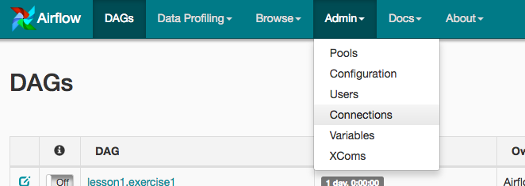

# Data Pipelines
## Introduction
A music streaming startup, Sparkify, has grown their user base and song database and want to move their processes and data onto the cloud. Their data resides in S3, in a directory of JSON logs on user activity on the app, as well as a directory with JSON metadata on the songs in their app.

## Project Overview
This project will introduce you to the core concepts of Apache Airflow. To complete the project, you will need to create your own custom operators to perform tasks such as staging the data, filling the data warehouse, and running checks on the data as the final step.


## Project Datasets
You'll be working with two datasets that reside in S3. Here are the S3 links for each:
```
Song data: s3://udacity-dend/song_data
Log data: s3://udacity-dend/log_data
```
### Song Dataset
The first dataset is a subset of real data from the Million Song Dataset. Each file is in JSON format and contains metadata about a song and the artist of that song. The files are partitioned by the first three letters of each song's track ID. For example, here are filepaths to two files in this dataset.
```
song_data/A/B/C/TRABCEI128F424C983.json
```
And below is an example of what a single song file, TRAABJL12903CDCF1A.json, looks like.
```json
{
  "num_songs": 1, 
  "artist_id": "ARJIE2Y1187B994AB7", 
  "artist_latitude": null, 
  "artist_longitude": null, 
  "artist_location": "", 
  "artist_name": "Line Renaud", 
  "song_id": "SOUPIRU12A6D4FA1E1", 
  "title": "Der Kleine Dompfaff", 
  "duration": 152.92036, 
  "year": 0
}
```
### Log Dataset
The second dataset consists of log files in JSON format generated by this event simulator based on the songs in the dataset above. These simulate app activity logs from an imaginary music streaming app based on configuration settings.

The log files in the dataset you'll be working with are partitioned by year and month. For example, here are filepaths to two files in this dataset.
``` 
log_data/2018/11/2018-11-12-events.json
```

## Add Airflow Connections
Here, we'll use Airflow's UI to configure your AWS credentials and connection to Redshift.

### To go to the Airflow UI:
- You can use the Project Workspace here and click on the blue Access Airflow button in the bottom right.
- If you'd prefer to run Airflow locally, open http://localhost:8080 in Google Chrome (other browsers occasionally have issues rendering the Airflow UI).

### Click on the Admin tab and select Connections.


### Under Connections, select Create.


### On the create connection page, enter the following values:

- Conn Id: Enter aws_credentials.
- Conn Type: Enter Amazon Web Services.
- Login: Enter your Access key ID from the IAM User credentials you downloaded earlier.
- Password: Enter your Secret access key from the IAM User credentials you downloaded earlier.
- Once you've entered these values, select Save and Add Another.


### On the next create connection page, enter the following values:

- Conn Id: Enter redshift.
- Conn Type: Enter Postgres.
- Host: Enter the endpoint of your Redshift cluster, excluding the port at the end. You can find this by selecting your cluster in the Clusters page of the Amazon Redshift console. See where this is located in the screenshot below. IMPORTANT: Make sure to NOT include the port at the end of the Redshift endpoint string.
- Schema: Enter dev. This is the Redshift database you want to connect to.
- Login: Enter awsuser.
- Password: Enter the password you created when launching your Redshift cluster.
- Port: Enter 5439.
- Once you've entered these values, select Save.


Awesome! You're now all configured to run Airflow with Redshift.

# Airflow Operators
## Stage Operator
The stage operator is expected to be able to load any JSON formatted files from S3 to Amazon Redshift. The operator creates and runs a SQL COPY statement based on the parameters provided. The operator's parameters should specify where in S3 the file is loaded and what is the target table.

The parameters should be used to distinguish between JSON file. Another important requirement of the stage operator is containing a templated field that allows it to load timestamped files from S3 based on the execution time and run backfills.

## Fact and Dimension Operators
With dimension and fact operators, you can utilize the provided SQL helper class to run data transformations. Most of the logic is within the SQL transformations and the operator is expected to take as input a SQL statement and target database on which to run the query against. You can also define a target table that will contain the results of the transformation.

Dimension loads are often done with the truncate-insert pattern where the target table is emptied before the load. Thus, you could also have a parameter that allows switching between insert modes when loading dimensions. Fact tables are usually so massive that they should only allow append type functionality.

## Data Quality Operator
The final operator to create is the data quality operator, which is used to run checks on the data itself. The operator's main functionality is to receive one or more SQL based test cases along with the expected results and execute the tests. For each the test, the test result and expected result needs to be checked and if there is no match, the operator should raise an exception and the task should retry and fail eventually.

For example one test could be a SQL statement that checks if certain column contains NULL values by counting all the rows that have NULL in the column. We do not want to have any NULLs so expected result would be 0 and the test would compare the SQL statement's outcome to the expected result.

# Run scripts
Start pipeline by running:
```bash 
start.sh
```